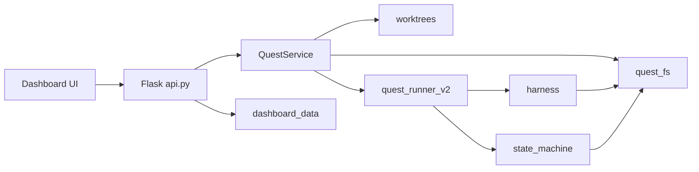

# Architecture

Quest Runner is a Sheaf project service that migrated from the external Conductor
repository's quest-runner components. It preserves quest lifecycle, harness
execution, recursive state machines, per-step git commits, and the web dashboard
while adopting Sheaf's project-local quest directory model.

## Module map

```text
projects/quest-runner/src/quest_runner_service/
  __main__.py              CLI entry; binds port 9002, configures logging
  api.py                   Flask REST routes and dashboard shell
  quest_service.py         create_quest, run_quest, scheduling, locks
  quest_fs.py              Project-local quest discovery and state files
  worktrees.py             Deterministic worktree create/locate helpers
  quest_runner.py          Legacy runner path and harness orchestration
  quest_runner_v2.py       V2 recursive state machine runner entry
  quest_thread.py          Role thread registry and runtime prompt context
  harness.py               Cursor/Codex/Claude harness adapters
  dashboard_data.py        Dashboard query parsing and JSON payloads
  dashboard_git.py         Git commit/diff payloads for dashboard
  dashboard_slice.py       Slice page and agent log payloads
  dashboard_runs.py        In-memory active run tracking
  quest_lock.py            Per-worktree run lock
  deferred_tasks.py        In-process deferred retry scheduling
  logging_config.py        Service log setup under logs/quest-runner/
  state_machine/           Recursive quest and slice machines
  dashboard_assets/        Web dashboard (HTML, CSS, ES modules)
  quest_docs/              Bundled runtime schema docs for role prompts
  roles/                   Role prompt templates
```

Tests mirror these modules under `projects/quest-runner/tests/`.

## Data flow



1. The dashboard loads project and quest lists from `/api/dashboard/projects` and
   `/api/dashboard/project_snapshot`.
2. Quest detail pages resolve checkout via worktree-first rules in
   `dashboard_data.resolve_dashboard_checkout`.
3. `POST /run_quest` schedules background execution through `QuestService`.
4. The v2 runner executes state-machine nodes, invokes harnesses for agent roles,
   enforces path rules, and commits step metadata to git in the quest worktree.

## State machine

The recursive quest machine lives under `state_machine/`. V2 quests use
normalized `state.md` at the quest root and legacy key/value slice `state.md`
files. Step commits carry `quest-step` metadata in commit messages; see
`state_machine/commit_metadata.py`.

Runtime schema reference for prompts comes from `quest_docs/`, not from
human-facing `projects/quest-runner/docs/`.

## Exclusion boundaries

Quest Runner intentionally does **not** include behavior that belongs to
`projects/conductor/`:

| Excluded capability | Where it remains |
| --- | --- |
| Service registration and lifecycle | `projects/conductor/` |
| SQLite / service database | `projects/conductor/` |
| Service log streaming APIs | `projects/conductor/` |
| MCP server and `/mcp` routes | Not migrated |

Quest Runner has no persistent database for quest state or discovery. All quest
artifacts are filesystem-backed under project-local quest directories.

## Logging

Service process logs: `logs/quest-runner/quest-runner.log` (rotating) plus
stdout/stderr capture from `start_quest_runner.sh`.

Quest step logs remain under each quest directory, for example
`logs/step_<n>_<role>.jsonl`.

See [Configuration](reference/config.md) and
[Logs and data](../../../structure/logs-and-data.md).

## Legacy quest exclusion

Discovery functions in `quest_fs.py` iterate `projects/*/quests/` only. The
top-level `quests/` tree is never scanned for dashboard or runner operations.

## Migration provenance

Internal parameter names such as `conductor_repo_path` refer to the Sheaf source
checkout where the Quest Runner package is installed. Public APIs and dashboard
copy use **Quest Runner** and **project** terminology, not Conductor service
orchestrator concepts.
